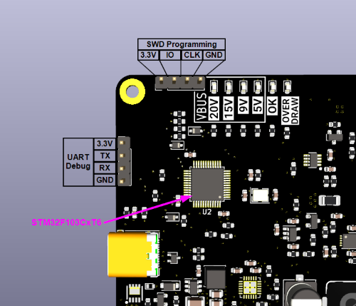

# ReMMI USB PD 100W Modular Synth PSU Firmware
This is the firmware source repo for the 
[Repowered Electronics](https://www.repoweredelectronics.com) + 
[MMI Modular](http://www.mmimodular.com) USB PD 100W Power Supply. 

## Overview

Our hardware uses an STM32F103CxT6 for control, housekeeping, power sequencing, 
and the like. The boilerplate firmware and HAL libraries were obtained from ST 
Microelectronics and much of the configuration code was generated using ST's 
[STM32CubeMX](https://www.st.com/content/st_com/en/stm32cubemx.html) software. 
The license(s) for all that is as-included with those source files.

Our hardware also relies on the 
[STUSB4500](https://www.st.com/en/interfaces-and-transceivers/stusb4500.html) 
for handling the USB PD (Power Delivery) negotiation. The microcontroller talks 
to this chip and configures things with it so it can ensure we're negotiating 
the right stuff, and figures out sensible overdraw limits. 

Power going out to your system is metered using a few 
[INA236 ](https://www.ti.com/product/INA236) chips. These monitor the power and 
can signal the micro to disable rails in the case of overdraw. Each converter 
also has hardware limits for gross-overcurrent conditions.

## Building

We built and tested this firmware using make and the 
[Arm GNU Toolchain](https://developer.arm.com/Tools%20and%20Software/GNU%20Toolchain). 
You're welcome of course to use whatever toolchain you like, but you're on your 
own.

## Uploading
We're working on a USB bootloader. But for now, you have to flash new firmware 
over Serial Wire Debug. We included an SWD header for programming and debug. 
Note that there's also a UART debugging header (115200 baud, 8N1). 

## Development Environment 

We've done our development primarily using VS Code with the 
[STM32 For VSCode](https://github.com/bmd-studio/stm32-for-vscode) plugin to 
help out with stuff. You might like it too.